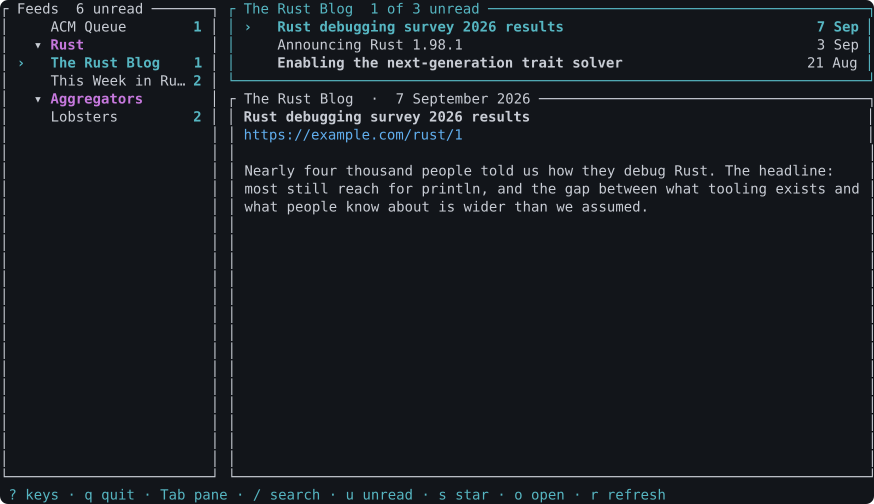

# rsst

A terminal RSS/Atom feed reader, built with [ratatui](https://ratatui.rs).



Three panes: your feeds on the left, that feed's entries top-right, the selected
entry below — rendered as a document, with code blocks kept verbatim, lists
bulleted, quotes marked and links numbered against a reference list. Feeds are fetched concurrently on launch and on demand.

There is a 20-second tour in [docs/img/demo.cast](docs/img/demo.cast) — play it
with `asciinema play docs/img/demo.cast`. Both it and the screenshot are
generated from the real binary, so neither can drift from the interface:

```sh
rsst --screenshot 104x30 > docs/img/rsst.svg
scripts/record-demo > docs/img/demo.cast
```

In a terminal that cannot draw box characters, `ascii = true` gives you
[this](docs/img/rsst-ascii.svg) instead.

## Install

```sh
cargo install --path .
```

## Usage

```sh
rsst                        # read your feeds
rsst --config path.toml     # use a different config
rsst --help
rsst --version

rsst import subs.opml       # merge an OPML list into your config
rsst export > subs.opml     # write your feeds out as OPML
```

Importing merges rather than replaces, so running it twice adds nothing the
second time. OPML folders become tags, and tags become folders on the way out.

## Configure

The first run writes a starter config and tells you where it lives:

- macOS: `~/Library/Application Support/rsst/config.toml`
- Linux: `~/.config/rsst/config.toml`
- Windows: `%APPDATA%\rsst\config.toml`

```toml
[[feeds]]
url = "https://blog.rust-lang.org/feed.xml"
title = "Rust Blog"        # optional; defaults to the feed's own title

[[feeds]]
url = "https://this-week-in-rust.org/atom.xml"
tags = ["Rust", "Core"]      # optional; the feed's folder path in the sidebar

# Optional. How many feeds may be fetched at once; defaults to 8.
max_concurrent_fetches = 8

# Optional. How often to refresh, in minutes; defaults to 30. Zero turns the
# timer off. Individual feeds can override it.
refresh_minutes = 30

# Optional. `terminal` (default) follows your terminal's own palette; `dark`
# and `light` pick the bright or dim half of it; `mono` uses no colour at all.
# Roles take a colour, attributes, or both — "bold cyan".
[theme]
name = "terminal"
accent = "cyan"
dim = "dim"

# Optional. Rebind any action; anything you leave out keeps its default.
# An override replaces the default, so `q` no longer quits here.
[keys]
quit = "x"
half_page_down = "ctrl-f"
```

Run `rsst --help` for every action name, or press `?` in the app. Setting
`NO_COLOR` disables colour whatever the config says.

Colours follow your terminal. rsst uses only the sixteen ANSI colours, which
Ghostty, iTerm2, Alacritty and the rest remap to their own themes — so it
follows your theme rather than fighting it. The status bar reverses rather than
picking a text colour, and read entries dim the foreground you already have
instead of fading to a fixed grey.

**[docs/config.example.toml](docs/config.example.toml) is the full reference** —
every key the parser accepts, with its default, and every action bound. It is
not prose that can drift: tests assert it parses, that it mentions every field
the config struct serializes, and that it binds every action the app knows.

## Mouse

rsst is usable entirely with the pointer. Click a feed or an entry to select it,
a group heading to fold it, a link to open it; double-click an entry to open it
in your browser. The wheel scrolls whichever pane it is over — by one item in a
list, by three lines in an article. The hints along the bottom are buttons, and
any click dismisses the key overlay.

While rsst holds the mouse your terminal cannot use it to select text. Most
terminals — Ghostty, iTerm2, kitty, Alacritty — give selection back if you hold
**Shift** while dragging. If you would rather have ordinary selection all the
time, set `mouse = false`.

## Keys

| Key            | Action                    |
| -------------- | ------------------------- |
| `j` / `↓`      | Next item, or scroll the detail pane |
| `k` / `↑`      | Previous item, or scroll back |
| `Tab`          | Cycle feeds → entries → detail |
| `g` / `G`      | First / last              |
| `Ctrl-d` / `Ctrl-u` | Half a pane down / up |
| `n` / `p`      | Next / previous unread, across feeds |
| `/`            | Search every feed (`n`/`N` step matches, `Esc` cancels) |
| `f`            | Fetch the full article for a summary-only feed |
| `s` / `S`      | Star the entry / show only starred |
| `m`            | Toggle read on the selected entry |
| `a` / `A`      | Mark this feed / every feed read (asks first) |
| `v`            | Show every feed as one list |
| `t`            | Oldest first / newest first |
| `u`            | Show only unread entries  |
| `o`            | Open the entry in your browser |
| `y`            | Copy its link to the clipboard |
| `r` / `R`      | Refresh all feeds / re-read the config |
| `Enter`        | Fold a folder shut (feed pane) |
| `M`            | Move this feed to a folder |
| `?`            | Show every key            |
| `q` / `Esc`    | Quit                      |

Starred entries are kept even after they fall out of the upstream feed, which is
the point of starring them.

Feeds are cached in a SQLite database, so launching is instant, a reader with no
network still shows the last entries it fetched, and refreshing one feed costs
the same whether you follow ten or a thousand. Search goes through a full-text
index rather than scanning everything in memory.

Entries you have read are remembered between runs, and each feed shows how many
are still unread. An entry is recognised by its guid, its link, and its title
and date together — so a feed that regenerates its identifiers does not come
back looking entirely unread.

A feed that fails to load is marked `!` in the feed list and explains itself in
the status bar while selected. It keeps showing whatever it last fetched, so one
dead URL costs you that feed's freshness and nothing else.

## Man page and completions

Both are generated by the binary, and ship in the release archives:

```sh
rsst --man > /usr/local/share/man/man1/rsst.1
rsst --completions fish > ~/.config/fish/completions/rsst.fish
rsst --completions zsh  > ~/.zfunc/_rsst
rsst --completions bash > ~/.local/share/bash-completion/completions/rsst
```

## Terminals

Tested in Apple Terminal and under a pseudo-terminal; other terminals are
expected to work but are not verified — see [docs/terminals.md](docs/terminals.md).
If borders come out as blocks, set `ascii = true` under `[theme]`.

## Develop

```sh
cargo test
cargo clippy --all-targets -- -D warnings
cargo fmt --all
cargo run --release --bin rsst-bench   # timings vs committed baselines
```

See [CONTRIBUTING.md](CONTRIBUTING.md) for the branch and PR workflow,
[ROADMAP.md](ROADMAP.md) for where this is going, [CHANGELOG.md](CHANGELOG.md)
for what has changed, and [docs/stability.md](docs/stability.md) for what
semver covers.

Found a security problem? [SECURITY.md](SECURITY.md) says how to report it
privately.

## License

MIT
